# NanoClaw Architecture

Living architecture documentation. Last updated: March 30, 2026.

---

## System Overview

NanoClaw is a Node.js process that orchestrates messaging channels, routes messages to Claude agents, and manages scheduled tasks. It operates in two deployment modes selected by the `AGENT_MODE` environment variable:

- **`cli` mode (default / standalone):** Single process with a message-poll loop, SQLite, and per-group Docker/Apple Container isolation. Agents run as child processes wrapping the `claude` CLI.
- **`sdk` mode (K8s / platform):** WebSocket management server (`ManagementServer`) that BearClaw Platform drives over a persistent connection. Agents run via `AgentRunnerProcess`, a stdin-IPC wrapper around the pre-compiled TypeScript agent-runner. Container image: `Dockerfile.ws`.

Security is achieved through OS-level container isolation and a credential proxy — no secrets are passed into containers directly.

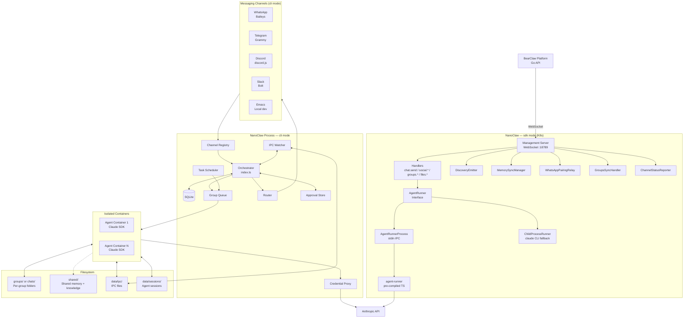

---

## Message Flow

From user message to agent response:

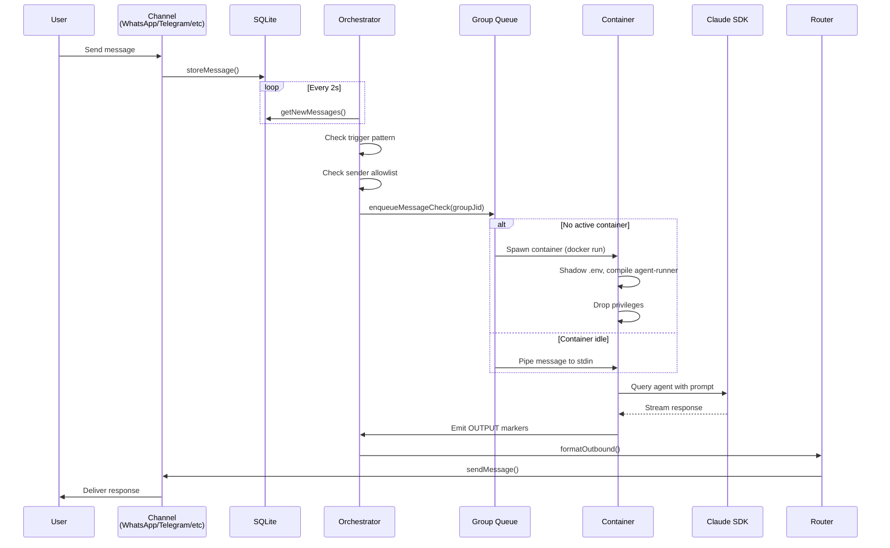

---

## Container Lifecycle

Each container runs an isolated Claude agent with its own filesystem, memory, and IPC namespace:

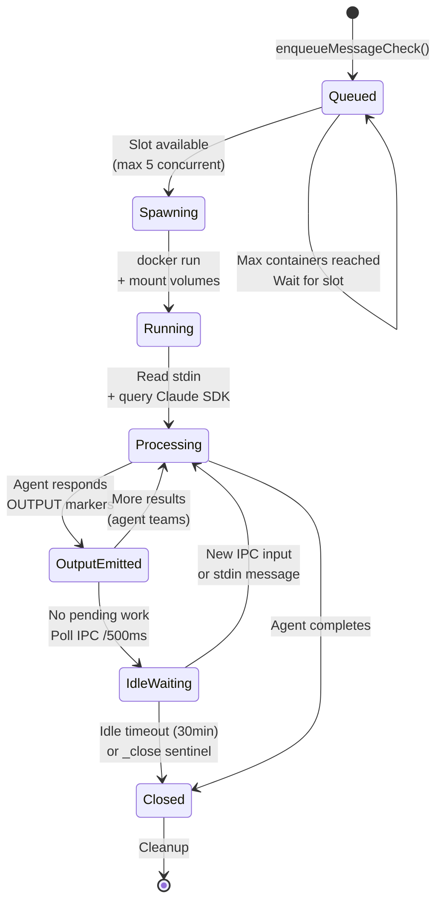

---

## Container Mount Architecture

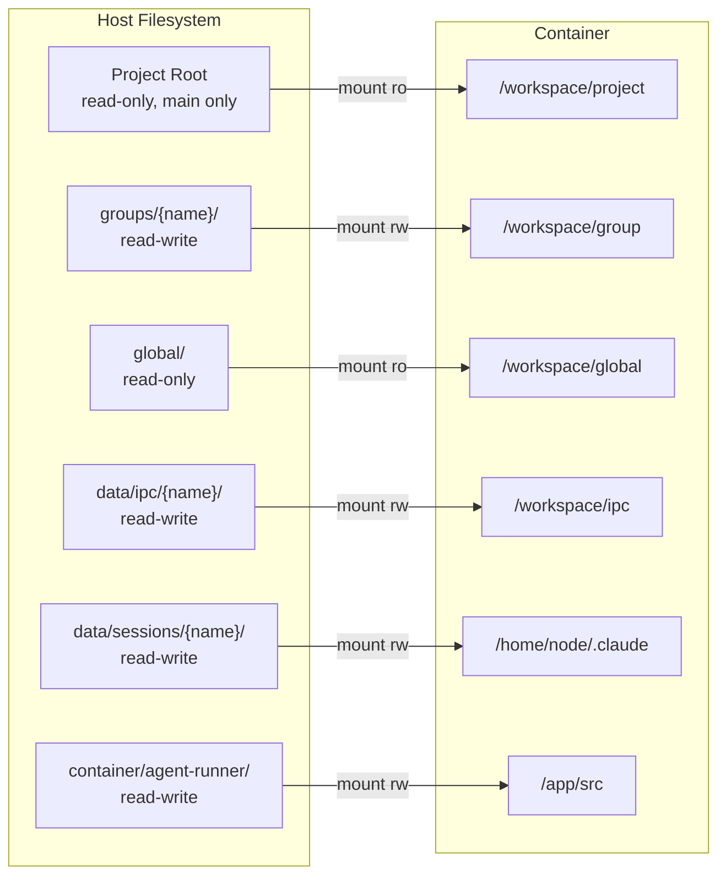

---

## Credential Security

Secrets never enter containers directly. A proxy intercepts API calls at the network boundary:

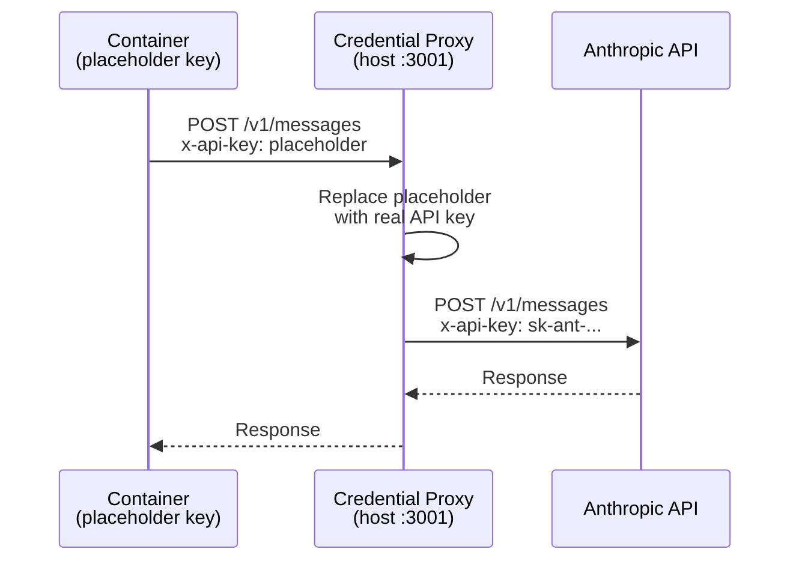

---

## Channel System

Channels self-register at startup via a factory pattern:

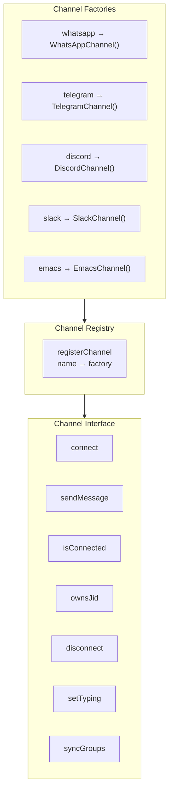

Each channel implements the `Channel` interface and provides two callbacks: `onMessage` for inbound messages and `onChatMetadata` for group discovery.

---

## Deployment Modes

NanoClaw selects its runtime mode via the `AGENT_MODE` environment variable:

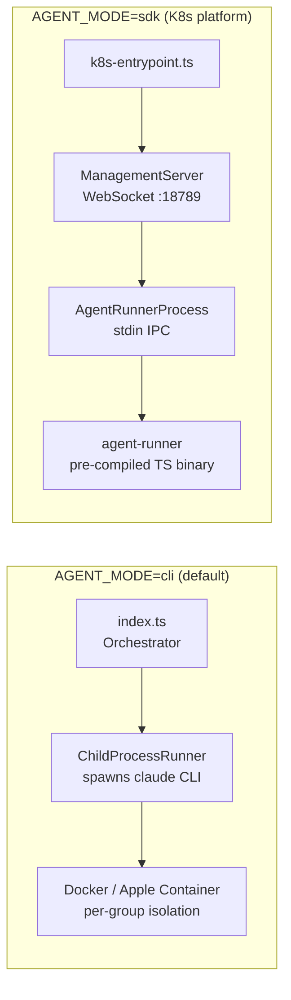

- **`cli` mode** — `src/index.ts` polls SQLite for messages, routes them through a group queue, and spawns isolated containers.
- **`sdk` mode** — `src/k8s-entrypoint.ts` starts a `ManagementServer`. BearClaw Platform connects over WebSocket and drives agents via JSON-framed protocol (auth → req/res/event frames). The `AgentRunnerProcess` spawns the pre-compiled agent-runner with stdin-based IPC.

---

## Management Layer (sdk mode)

The management layer is a WebSocket server that BearClaw Platform uses to control NanoClaw agents in K8s deployments.

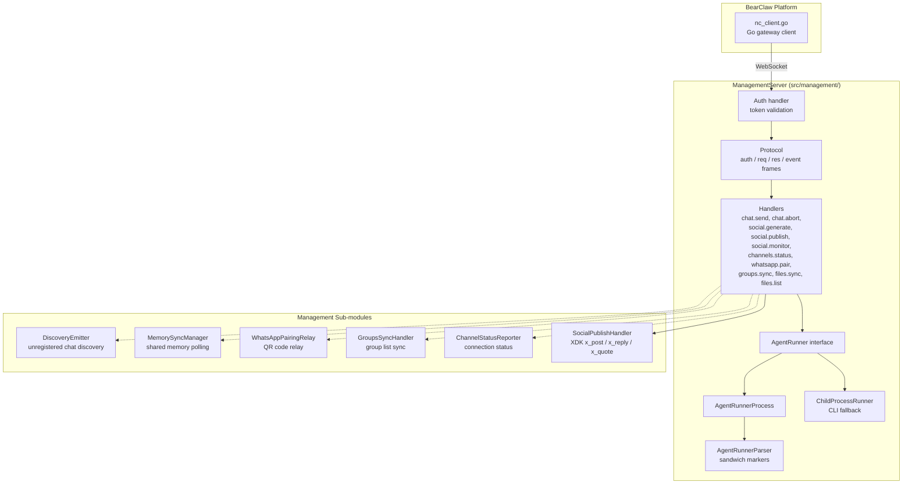

**Protocol frames:** Each message is a JSON object with `type` discriminator. The handshake sends `{type:"auth", token}` → receives `{type:"auth", ok:true}`. Requests are `{type:"req", id, method, params}` → responses `{type:"res", id, ok, result|error}`. Server pushes `{type:"event", event, payload}`.

---

## Approval System

Containers can request human approval before executing sensitive social actions. The approval loop uses SQLite persistence and IPC files.

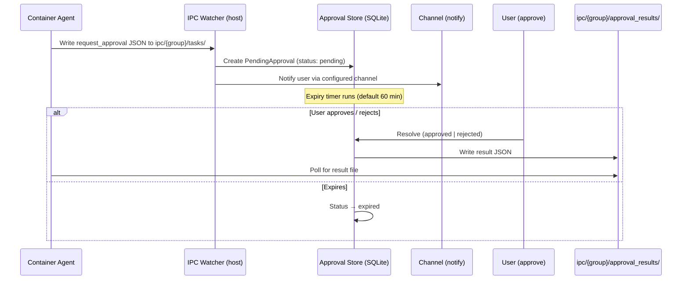

**Approval policy** (`approval-policy.json`): defines per-action `mode` (`auto`, `confirm`, `block`), `notifyChannels`, and `expiryMinutes`. Loaded at startup; defaults to `confirm` for all actions.

---

## X (Twitter) Integration

X integration ships as container skills, loaded at runtime. The `AgentRunnerProcess` carries skills into the container alongside the agent-runner binary.

```mermaid
graph TB
    subgraph ContainerSkills["container/skills/x-integration/"]
        TOOLS[MCP Tools<br/>x_post, x_reply, x_quote,<br/>x_timeline, x_search]
        XA[X Actions Module<br/>wraps XDK SDK calls]
        XC[XDK Client Wrapper<br/>@xdevplatform/xdk]
    end

    subgraph Publishing["Social Publish (management layer)"]
        SP[social-publish.ts<br/>handleSocialPublish()]
        XDK[@xdevplatform/xdk<br/>Client]
    end

    SM[social.monitor<br/>gateway handler] --> SMP[SocialMonitor<br/>pipeline orchestrator]
    SMP --> SDD[Deduplication Store]
    SMP --> DPB[Decision Prompt Builder]
    SMP --> EL[Engagement Log]
    SMP --> XC

    SP --> XDK
    TOOLS --> XA --> XC
```

**Credential injection:** `X_ACCESS_TOKEN` is injected by OneCLI at container startup. The agent-runner never sees raw API keys.

---

## Scheduled Tasks

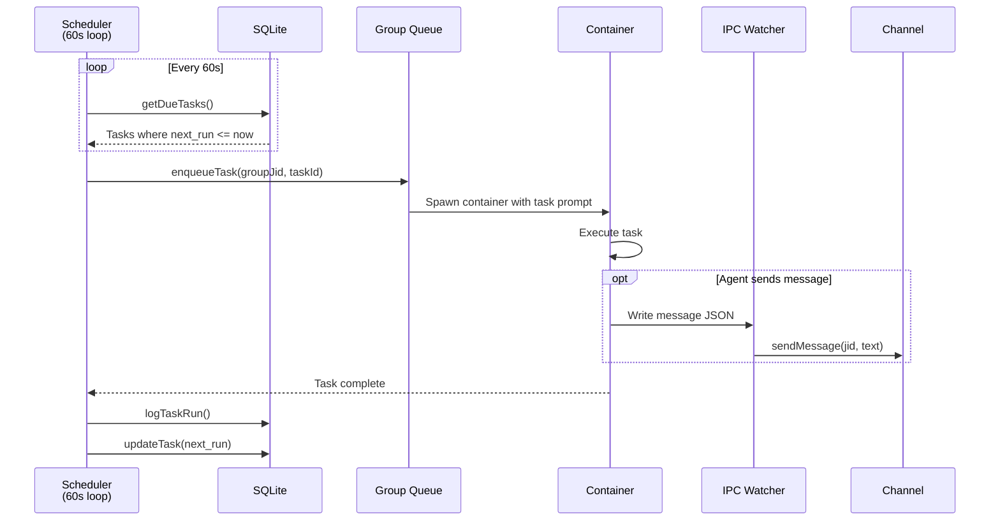

---

## IPC System

Bidirectional communication between host and containers via filesystem:

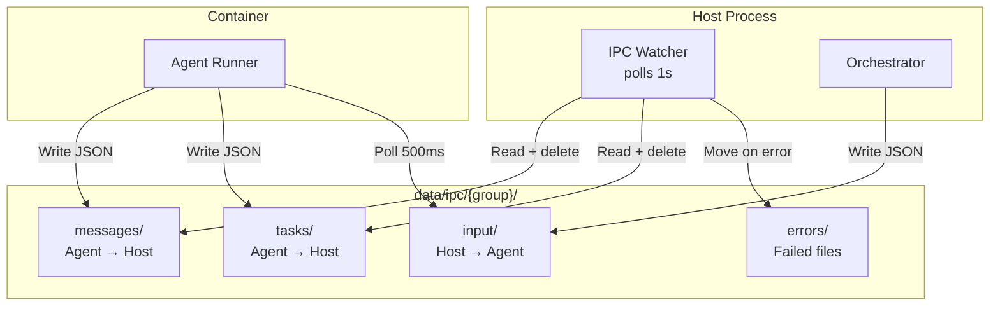

**Authorization:** Main group can send to any JID and manage any task. Non-main groups are restricted to their own JID and tasks.

---

## Database Schema

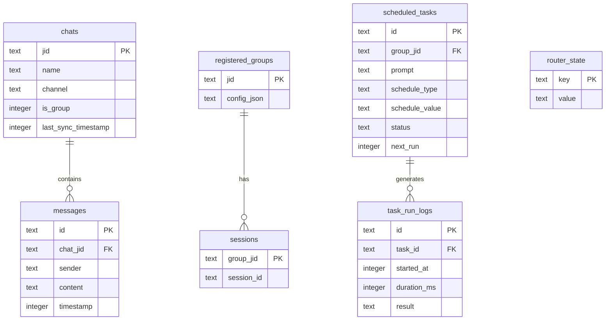

---

## Key Configuration

| Setting | Default | Purpose |
|---------|---------|---------|
| `AGENT_MODE` | `cli` | `cli` = standalone, `sdk` = K8s WebSocket management server |
| `ASSISTANT_NAME` | `@Andy` | Trigger word prefix |
| `POLL_INTERVAL` | 2000ms | Message polling frequency (cli mode) |
| `CONTAINER_TIMEOUT` | 1800s | Max container runtime |
| `IDLE_TIMEOUT` | 1800s | Keep idle container alive |
| `MAX_CONCURRENT_CONTAINERS` | 5 | Concurrency limit (cli mode) |
| `MAX_CONCURRENT_AGENTS` | 3 | Concurrency limit (sdk mode) |
| `MANAGEMENT_PORT` | 18789 | WebSocket management server port (sdk mode) |
| `IPC_POLL_INTERVAL` | 1000ms | IPC file check frequency |
| `SCHEDULER_POLL_INTERVAL` | 60000ms | Task scheduler check |
| `SYSTEM_PROMPT` | — | Per-instance system prompt injected by platform |
| `X_ACCESS_TOKEN` | — | Injected by OneCLI; used by X integration and social-publish |

---

## File Map

| File | Purpose |
|------|---------|
| `src/index.ts` | Orchestrator: state, message loop, agent invocation (cli mode) |
| `src/k8s-entrypoint.ts` | K8s entrypoint: starts ManagementServer + channels (sdk mode) |
| `src/db.ts` | SQLite schema and queries |
| `src/container-runner.ts` | Spawn containers with mounts |
| `src/container-runtime.ts` | Runtime abstraction (Apple Container/Docker/Podman) |
| `src/credential-proxy.ts` | Secure credential injection proxy |
| `src/child-process-runner.ts` | AgentRunner impl: spawns claude CLI directly |
| `src/agent-runner-process.ts` | AgentRunner impl: spawns pre-compiled agent-runner via stdin IPC |
| `src/approval.ts` | Approval policy loader, SQLite store, IPC result writer |
| `src/group-queue.ts` | Per-group concurrency control |
| `src/task-scheduler.ts` | Scheduled task execution |
| `src/ipc.ts` | Host-container IPC watcher |
| `src/router.ts` | Message formatting and channel lookup |
| `src/config.ts` | Environment-driven configuration |
| `src/types.ts` | Core interfaces |
| `src/shared-prompt.ts` | Shared system prompt fragments (SHARED_RESOURCE_PROMPT, X_INTEGRATION_PROMPT) |
| `src/channels/registry.ts` | Channel factory pattern |
| `src/channels/*.ts` | Channel implementations |
| `src/management/server.ts` | WebSocket ManagementServer (sdk mode) |
| `src/management/protocol.ts` | Frame types: auth, req, res, event |
| `src/management/handlers.ts` | Handler registry: chat.send, social.*, groups.*, files.* |
| `src/management/agent-runner.ts` | AgentRunner interface |
| `src/management/agent-runner-parser.ts` | Streaming sandwich-marker parser for agent-runner output |
| `src/management/social-publish.ts` | Social publish via XDK (x_post, x_reply, x_quote) |
| `src/management/discovery.ts` | DiscoveryEmitter: unregistered chat detection |
| `src/management/memory-sync.ts` | MemorySyncManager: shared memory file polling |
| `src/management/whatsapp-relay.ts` | WhatsAppPairingRelay: QR code relay for pairing |
| `src/management/groups-sync.ts` | GroupsSyncHandler: group list sync |
| `src/management/channel-status.ts` | ChannelStatusReporter: connection status |
| `container/Dockerfile` | Agent container image (cli mode) |
| `container/Dockerfile.ws` | K8s WebSocket container image (sdk mode, Chromium pre-installed) |
| `container/agent-runner/` | Pre-compiled TypeScript agent-runner with stdin IPC |
| `container/skills/` | Container-loaded skills (X integration, browser, status, formatting) |
